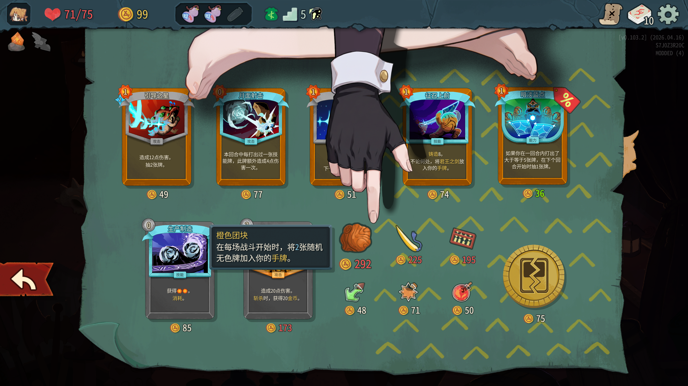
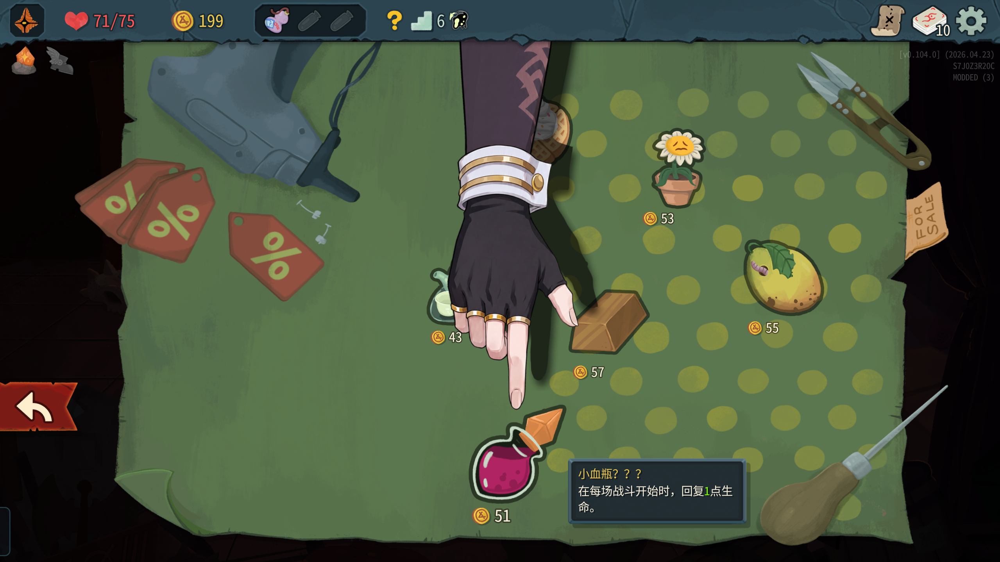
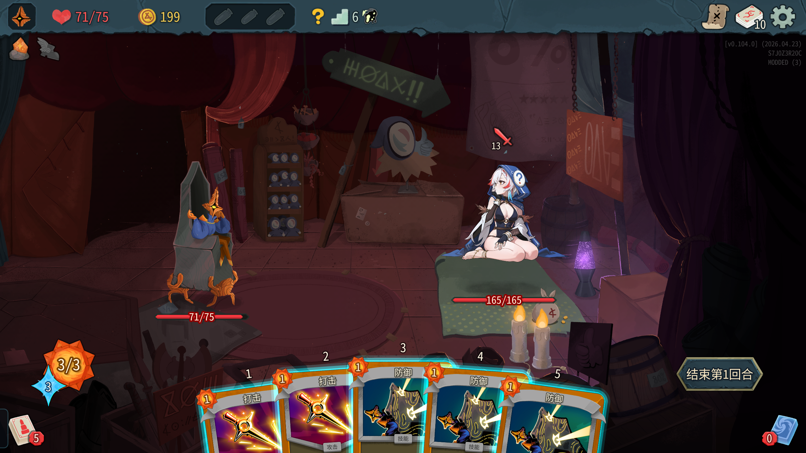

# [STS2 mod] 商人娘化mod2

本项目的贴图基于AI生成并进行了部分修改。

# mod使用方法

1. 下载 [Releases] 的Merchant2CuteII压缩包 解压到杀戮尖塔2游戏目录下的mods文件夹。
2. 如果没有mods文件夹可以手动创建。
3. 如果无法使用命令行修改，在用户数据下找到merchant2cute_config.json修改里面的参数

### v1.4.0-260506

命令重置说明：

- merchant point hand|foot|toggle|status
    - 说明：将原先的 `merchant hand` / `merchant foot` 移至 `point` 子命令下，用于切换商人手/脚。
    - 说明补充：新增 `white` 与 `black` 两个子选项。
    - 示例：
        - `merchant point white` — 切换为 white 变体（脚样式）。
        - `merchant point black` — 切换为 black 变体（脚样式）。
    - 参数：hand/foot/

- merchant foul poison|toggle|status
    - 说明：设置在投掷有害药水（FoulPotionThrown）时使用的动画名称（默认 `poison`）。

- merchant voice default|jp|zh|toggle|status|db <value>
    - 说明：切换/查询商人语音变体；新增 `db` 子命令用于设置 `ExtraDb`（以 dB 为单位的额外增益，用于替换音频播放时调整音量）。
    - 示例：`merchant voice db 3.0` 将 `ExtraDb` 设置为 +3.0 dB 并持久化。
    - 建议：±10.0 dB以内，别伤到耳朵了。

所有设置（point/voice/foul/ExtraDb）将保存到 `user://merchant2cute_config.json`，在启动时自动加载。

### v1.3.0-260503

更新配音
命令行:
merchant voice default|zh|jp
切换原版、中文、日语配音

### v1.2.0-260501

更新hand-foot切换。
按( ` )键打开杀戮尖塔2的控制台，输入merchant hand或者merchant foot进行切换。

### v1.1.1-260430

### v1.1.0-260429

添加了假商人和战斗动画。动画做的很烂 X）不过很难和假商人打一架所以无关紧要......吧。

### v1.0.0-260428

速度赶出来的版本，只在STS2进行了简单测试。

该版本只包含商人部分，不包含假商人。（储君娘化mod为Mesugaki_Regent）

